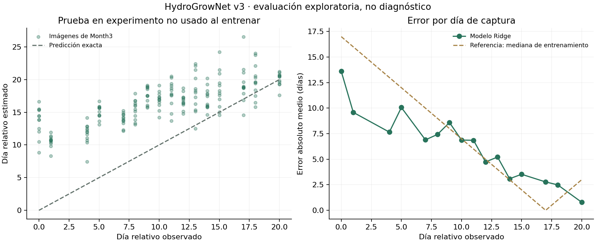

# Resultado del entrenamiento — 8 de septiembre de 2026

**Se entrenó un modelo real, pero el resultado todavía no es suficientemente
confiable para incorporarlo al monitoreo operativo.**

Tarea: estimar el día transcurrido desde la primera fecha registrada de cada
experimento usando solo características de imágenes segmentadas. Esta etiqueta
no representa edad biológica, crecimiento futuro, peso ni enfermedad.

## Datos usados y separación

El índice de los tres ZIP publicados de HydroGrowNet v3 contiene 124.486 PNG:
62.960 en Month1, 35.043 en Month2 y 26.483 en Month3. La descripción del dataset
habla de más de 390.000 imágenes; no se asume que esa cifra sea la cantidad
presente en estos archivos segmentados. No se encontraron archivos tabulares
entre sus miembros; las únicas entradas adicionales eran directorios.

Se descargó una muestra determinista de 12 imágenes por fecha disponible:

| Conjunto | Experimento | Fechas con imágenes | Muestras | Intervalo de etiqueta |
| --- | --- | --- | --- | --- |
| Entrenamiento | Month1 | 17 | 204 | 0–26 días |
| Validación | Month2 | 18 | 216 | 0–26 días |
| Prueba final | Month3 | 16 | 192 | 0–20 días |

Total: **612 imágenes**, sin duplicados exactos ni imágenes rechazadas en esta
muestra. No se entrenó sobre el dataset completo. Las fechas no son consecutivas
y los experimentos tienen distribuciones temporales diferentes.

## Método y resultados

Ridge con 25 características visuales y normalización calculada exclusivamente
en entrenamiento. La validación seleccionó alpha=1000 entre cinco candidatos.
No se reajustaron parámetros después de observar la prueba final.

| Conjunto | MAE del modelo | MAE de referencia | RMSE del modelo | R² del modelo |
| --- | --- | --- | --- | --- |
| Entrenamiento | 4,60 días | 7,94 días | 5,42 días | 0,640 |
| Validación | 5,42 días | 8,11 días | 6,48 días | 0,388 |
| Prueba final | **6,26 días** | **7,25 días** | **7,24 días** | **−0,606** |

La referencia responde siempre la mediana de las etiquetas de entrenamiento.
La reducción de MAE en prueba es aproximadamente 13,6 %, pero el R² negativo
indica que el error cuadrático es peor que usar la media del conjunto de prueba
como referencia descriptiva. Esa media no es un predictor desplegable calculado
sin etiquetas de prueba. La mejora sobre la referencia de entrenamiento **no
basta para afirmar generalización ni aprendizaje suficiente**.

## Pruebas dejadas en el proyecto

- Descarga real de muestras con validación CRC/tamaño y manifiesto SHA-256.
- Entrenamiento real; modelo JSON guardado y predicciones por imagen exportadas.
- Ejecución de inferencia independiente sobre una imagen del tercer experimento.
- Siete pruebas automatizadas del módulo: separación de experimentos y duplicados,
  experimento desconocido, características invariantes a posición, imágenes vacías,
  aprendizaje de una señal conocida y serialización, métricas/entradas inválidas,
  extracción por rangos y detección de CRC incorrecto.
- Suite completa del proyecto: **44 pruebas aprobadas**.

Los casos sintéticos de pytest verifican el código; las métricas de esta página
provienen de imágenes de HydroGrowNet, no de esos casos sintéticos.

## Qué falta para un modelo útil para la tesis

Definir un objetivo agronómico medido (por ejemplo, área proyectada anotada o
biomasa medida), verificar identificadores de planta y protocolo de captura,
y reunir validación propia DWC. Un nuevo experimento que cambie el modelo después
de consultar estos resultados necesitará un conjunto final de prueba nuevo.
El modelo permanece opcional y sin acceso al PID. El dashboard de Visión muestra
las evidencias guardadas, sin ejecutar inferencia sobre capturas del usuario.

Ver [método y reproducción](README.md), [métricas completas](metrics.json),
[predicciones](predictions.csv), [modelo](model.json) y
[procedencia](source.json).
